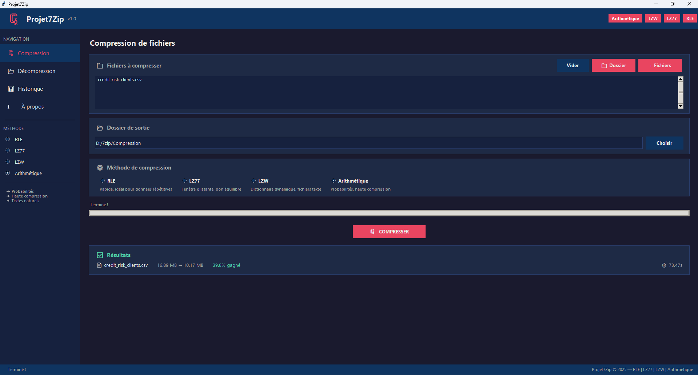
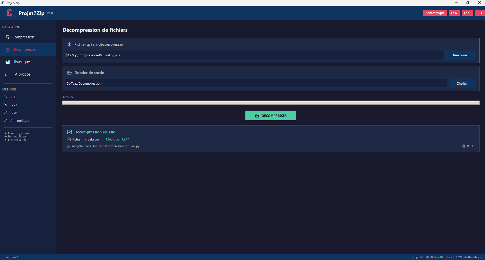
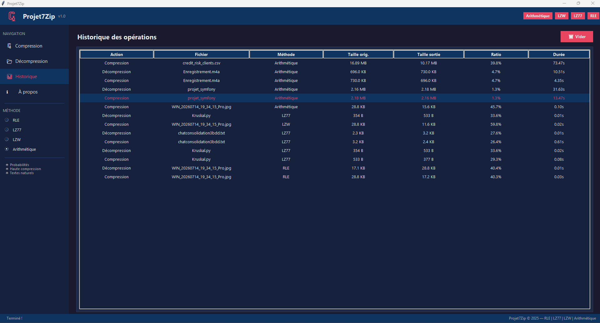
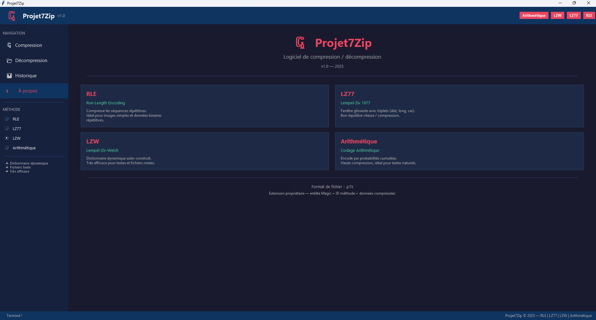

# 🗜 Projet7Zip

> Logiciel de compression et décompression de fichiers développé en Python avec Tkinter.  
> Inspiré de 7-Zip, il implémente des algorithmes de compression vus en cours.


---

## 📋 Description

**Projet7Zip** est un logiciel de compression/décompression de fichiers développé dans le cadre d'un cours de **Technique de Compression de Données**.  
Il implémente plusieurs algorithmes de compression sans perte vus en cours et génère des archives au format propriétaire `.p7z`.

---

## ✨ Fonctionnalités

- 🗜 **Compression** de fichiers avec choix de la méthode
- 📂 **Décompression** des archives `.p7z`
- 📊 **Historique** de toutes les opérations (action, fichier, méthode, taille, ratio, durée)
- ⚙️ **4 méthodes** de compression disponibles
- 🎨 Interface graphique moderne avec thème sombre

---

## 🧠 Méthodes de compression implémentées

| Méthode | Nom complet | Description |
|---------|-------------|-------------|
| **RLE** | Run-Length Encoding | Compresse les séquences répétitives. Rapide, idéal pour images simples. |
| **LZ77** | Lempel-Ziv 1977 | Fenêtre glissante avec triplets (distance, longueur, caractère). Bon équilibre vitesse/compression. |
| **LZW** | Lempel-Ziv-Welch | Dictionnaire dynamique auto-construit. Très efficace pour fichiers texte. |
| **Arithmétique** | Codage Arithmétique | Encode par probabilités cumulées. Haute compression, idéal pour textes naturels. |

---

## 📸 Captures d'écran

### 🗜 Compression
> Sélectionnez un fichier, choisissez la méthode et compressez en un clic.



---

### 📂 Décompression
> Parcourez et restaurez vos fichiers `.p7z` vers le dossier de votre choix.



---

### 📊 Historique des opérations
> Consultez toutes les compressions et décompressions effectuées avec leurs statistiques détaillées.



---

### ℹ️ À propos
> Présentation du logiciel et des 4 méthodes de compression implémentées.



---

## 🚀 Installation et lancement

### Prérequis
- Python 3.10 ou supérieur
- pip

### Installation des dépendances

```bash
pip install Pillow
```

### Lancement

```bash
python projet7zip.py
```

### Créer un exécutable (.exe)

```bash
python build.py
```

L'exécutable sera généré dans le dossier `dist/`.

### Voir le logiciel exécutable (.exe) dans le dossier du projet sur github repo Projet7zip

Le logiciel exécutable est dans le dossier du projet `dist/`.

Ou

Il existe un Version MVP du logiciel V1.0 (.exe) près a etre telecharger dans releases repo Github Projet7zip.
Logiciel executable sur Windows.

---

## 📁 Structure du projet

```
Projet7Zip/
├── projet7zip.py        # Interface graphique principale (Tkinter)
├── algorithms.py        # Moteur de compression (RLE, LZ77, LZW, Arithmétique)
├── build.py             # Script de création de l'exécutable
├── screenshots/
│   ├── Compression.png
│   ├── Decompression.png
│   ├── Historique.png
│   └── A_propos.png
└── README.md
```

---

## 📦 Format de fichier `.p7z`

Les archives générées utilisent un format propriétaire structuré comme suit :

```
[4B magic "P7Z\x01"] [1B method_id] [4B orig_size] [4B name_len] [name] [compressed data]
```

| Champ | Taille | Description |
|-------|--------|-------------|
| Magic | 4 bytes | Identifiant `P7Z\x01` |
| Method ID | 1 byte | 1=RLE, 2=LZ77, 3=LZW, 4=Arithmétique |
| Orig size | 4 bytes | Taille originale du fichier |
| Name len | 4 bytes | Longueur du nom de fichier |
| Name | N bytes | Nom du fichier original |
| Data | M bytes | Données compressées |

---

## 📊 Résultats de tests

| Fichier | Méthode | Taille originale | Taille compressée | Ratio |
|---------|---------|-----------------|-------------------|-------|
| `credit_risk_clients.csv` | Arithmétique | 16.89 MB | 10.17 MB | **39.8%** |
| `Kruskal.py` | LZ77 | 533 B | 377 B | **29.3%** |
| `WIN_...Pro.jpg` | LZW | 28.8 KB | 11.6 KB | **59.8%** |
| `chatconsolidation3bdd.txt` | LZ77 | 3.2 KB | 2.4 KB | **26.4%** |

---

## 🧪 Fichiers de test

Des fichiers de test sont disponibles dans ce repository :

📁 **fichiers_compressers/** — Fichiers compressés au format `.p7z`
📁 **fichiers_decompressers/** — Fichiers décompressés (fichiers originaux restaurés)

### Comment tester
1. Téléchargez et installer `Projet7Zip.exe`
2. Ouvrez et telecharger un fichier quelconque dans le dossier `fichier_decompressers/` dans repo
3. Tester dans le logiciel et compressez pour avoir un `fichier.p7z/`
3. Ouvrez et telecharger un fichier `.p7z` dans dossier `fichier_compressers/`
4. Tester le dans le logiciel et décompressez-le pour avoir un `fichiers original`
5. Et ainsi de suite pour tester autres fichiers
6. Vérifiez que le fichier est bien restauré

## 👤 Auteur

**Rochel-10**  
🔗 [github.com/Rochel-10](https://github.com/Rochel-10)

---
